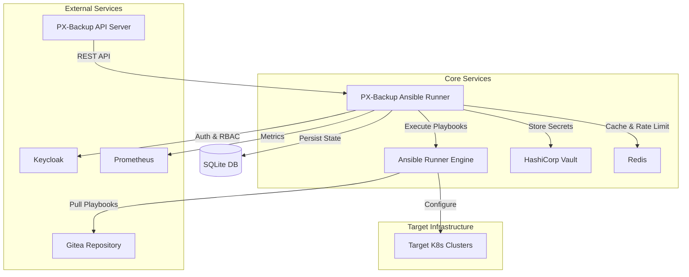

# PX-Backup Ansible Runner

[](https://github.com/portworx/pxbackup-ansible-runner/actions/workflows/test.yml)
[](https://codecov.io/gh/portworx/pxbackup-ansible-runner)

A Flask-based microservice that manages Kubernetes cluster integration with PX-Backup through Ansible playbooks. This service handles:
- Adding new clusters to PX-Backup
- Updating service account credentials
- Managing cluster authentication
- Monitoring cluster connectivity

## Features

- **Automated Cluster Integration**: Streamlined process for adding Kubernetes clusters to PX-Backup
- **Service Account Management**: Automated creation and renewal of Kubernetes service accounts
- **Security First**: Built-in authentication, authorization, and secure secret management
- **Monitoring & Metrics**: Prometheus metrics for operation tracking and monitoring
- **Scalable Architecture**: Designed to handle multiple clusters and concurrent operations
- **Audit Logging**: Comprehensive logging of all operations for compliance and debugging

## Architecture

The PX-Backup Ansible Runner is designed as a microservice-based architecture that orchestrates cluster operations through Ansible playbooks. Here's a detailed view of the component interactions:



### Component Roles
- **PX-Backup API Server**: Initiates cluster operations and manages backup policies
- **Ansible Runner**: Core service that executes playbooks and manages state
- **Vault**: Secure storage for cluster credentials and service tokens
- **Redis**: Handles caching and rate limiting
- **Keycloak**: Manages authentication and RBAC
- **Gitea**: Stores and versions Ansible playbooks
- **SQLite**: Local database for persisting operational state and audit logs

## Prerequisites

- Python 3.9-3.11
- Docker (Fedora/CentOS/Alpine based containers)
- Kind
- kubectl
- Redis (for caching and rate limiting)
- Vault instance

## Prerequisites Installation

### Fedora (Recommended)
```bash
# Enable RPM Fusion repositories (required for some dependencies)
sudo dnf install -y https://download1.rpmfusion.org/free/fedora/rpmfusion-free-release-$(rpm -E %fedora).noarch.rpm
sudo dnf install -y https://download1.rpmfusion.org/nonfree/fedora/rpmfusion-free-release-$(rpm -E %fedora).noarch.rpm

# Install system dependencies
sudo dnf update -y
sudo dnf install -y \
    python3.11 \
    python3.11-devel \
    python3-pip \
    python3-virtualenv \
    git \
    make \
    gcc \
    openssl-devel \
    libffi-devel \
    docker-ce \
    docker-ce-cli \
    containerd.io

# Install Docker (if not installed via dnf)
if ! command -v docker &> /dev/null; then
    sudo dnf config-manager --add-repo https://download.docker.com/linux/fedora/docker-ce.repo
    sudo dnf install -y docker-ce docker-ce-cli containerd.io
fi

# Install kubectl
curl -LO "https://dl.k8s.io/release/$(curl -L -s https://dl.k8s.io/release/stable.txt)/bin/linux/amd64/kubectl"
chmod +x kubectl
sudo mv kubectl /usr/local/bin/

# Install Kind
curl -Lo ./kind https://kind.sigs.k8s.io/dl/v0.20.0/kind-linux-amd64
chmod +x ./kind
sudo mv ./kind /usr/local/bin/

# Start and enable Docker service
sudo systemctl enable docker
sudo systemctl start docker

# Add current user to docker group (requires logout/login to take effect)
sudo usermod -aG docker $USER

# Verify installations
python3.11 --version
docker --version
kubectl version --client
kind version
```

### RHEL/CentOS
```bash
# Enable EPEL repository
sudo dnf install -y epel-release

# Install system dependencies
sudo dnf update -y
sudo dnf install -y \
    python3.11 \
    python3.11-devel \
    python3-pip \
    python3-virtualenv \
    git \
    make \
    gcc \
    openssl-devel \
    libffi-devel

# Follow same Docker, kubectl, and Kind installation steps as Fedora
```

### Ubuntu/Debian
```bash
# Add Python PPA for Python 3.11
sudo add-apt-repository ppa:deadsnakes/ppa

# Update package lists
sudo apt-get update

# Install system dependencies
sudo apt-get install -y \
    python3.11 \
    python3.11-dev \
    python3.11-venv \
    python3-pip \
    git \
    make \
    gcc \
    libssl-dev \
    libffi-dev

# Install Docker
curl -fsSL https://get.docker.com -o get-docker.sh
sudo sh get-docker.sh

# Follow same kubectl and Kind installation steps as Fedora
```

### Post-Installation Steps
```bash
# Verify Python version meets requirements (3.9-3.11)
python3.11 --version

# Verify Docker installation
docker run hello-world

# Verify kubectl installation
kubectl version --client

# Verify Kind installation
kind version

# Note: You may need to log out and log back in for docker group changes to take effect
# To use docker without sudo immediately:
newgrp docker
```

## Local Development Setup

1. **System Dependencies (Fedora)**
```bash
# Install system dependencies
sudo dnf install -y \
    python3.11 \
    python3.11-devel \
    python3-pip \
    python3-virtualenv \
    docker \
    kubectl

# Install Kind
curl -Lo ./kind https://kind.sigs.k8s.io/dl/v0.20.0/kind-linux-amd64
chmod +x ./kind
sudo mv ./kind /usr/local/bin/

# Start Docker service
sudo systemctl start docker
```

2. **Clone and Configure Repository**
```bash
# Clone repository
git clone https://github.com/portworx/pxbackup-ansible-runner.git
cd pxbackup-ansible-runner

# Create and activate virtual environment for local development
python3.11 -m venv .venv
source .venv/bin/activate

# Install development dependencies for local testing
pip install -r requirements-dev.txt
```

3. **Set Up Development Environment**
```bash
# Run the development setup script
./scripts/setup_dev.sh

# This script will:
# - Create a Kind cluster with required configuration
# - Create pxbackup namespace
# - Deploy Redis, Vault, Keycloak, Gitea, and Prometheus services
# - Build and load the Flask application image
# - Deploy the Flask application as a pod
# - Configure all environment variables via ConfigMap
```

4. **Access the Application**
```bash
# Get the NodePort for the Flask application
kubectl get svc flask-app -n pxbackup

# The application is available at:
# http://localhost:30500 (NodePort 30500)

# View application logs
kubectl logs -f deployment/flask-app -n pxbackup

# View application configuration
kubectl describe configmap flask-config -n pxbackup
```

5. **Development Workflow**
```bash
# Make code changes locally
vim app/routes.py

# Rebuild and redeploy the application
docker build -t pxbackup-flask:dev .
kind load docker-image pxbackup-flask:dev
kubectl rollout restart deployment/flask-app -n pxbackup

# View updated logs
kubectl logs -f deployment/flask-app -n pxbackup
```

6. **Verify Installation**
```bash
# Check all services are running
kubectl get pods -n pxbackup

# Test the application
curl http://localhost:30500/ready

# View Prometheus metrics
curl http://localhost:30500/metrics
```

## Configuration

The service is configured through environment variables:

```bash
# Core Settings
FLASK_APP=app
FLASK_ENV=production
SQLALCHEMY_DATABASE_URI=sqlite:///app.db

# Authentication (supports both Okta and Keycloak)
OKTA_ISSUER=https://your-org.okta.com
OKTA_CLIENT_ID=your-client-id
# OR
KEYCLOAK_URL=http://keycloak:8080
KEYCLOAK_REALM=pxbackup
KEYCLOAK_CLIENT_ID=pxbackup-client
KEYCLOAK_CLIENT_SECRET=your-secret

# External Services
VAULT_ADDR=http://vault:8200
VAULT_TOKEN=your-token
REDIS_URL=redis://redis:6379/0
GITHUB_TOKEN=your-github-token
PLAYBOOKS_DIR=/playbooks
```

## Testing and Quality Checks

The project includes comprehensive testing and code quality checks:

### Unit Tests
```bash
# Run tests with coverage
pytest --cov=app --cov-report=html

# Run specific test types
pytest tests/unit/
pytest tests/integration/
```

### Code Quality
```bash
# Format code
black app tests
isort app tests

# Type checking
mypy app tests --strict

# Linting
flake8 app tests --max-complexity=10 --max-line-length=100
pylint app tests --fail-under=8.0
```

### Security Checks
```bash
# Run security analysis
bandit -r app -ll
safety check

# Run Ansible playbook linting
ansible-lint playbooks/
```

### Continuous Integration

The project uses GitHub Actions for CI/CD with the following checks:

1. **Tests**
   - Runs pytest with coverage reporting
   - Uploads results to Codecov
   - Tests against Python 3.11
   - Uses in-memory SQLite database
   - Requires Redis service

2. **Code Quality**
   - Black code formatting
   - isort import sorting
   - flake8 linting
   - mypy type checking
   - pylint code analysis

3. **Security**
   - Bandit security analysis
   - Safety dependency checking
   - Semgrep static analysis
   - Weekly security scans
   - Dependency review on PRs

4. **Ansible**
   - Ansible playbook linting
   - Syntax checking
   - Best practices validation

Test results and security reports are uploaded as artifacts and retained for 30 days.

## Troubleshooting Guide

### Common Issues and Solutions

#### Docker Issues

1. **Docker Service Not Starting**
```bash
# Check Docker service status
sudo systemctl status docker

# Common fixes:
sudo systemctl restart docker
sudo systemctl enable docker

# Check Docker logs
journalctl -xu docker
```

2. **Permission Denied**
```bash
# Error: Got permission denied while trying to connect to the Docker daemon socket
# Solution: Add user to docker group
sudo usermod -aG docker $USER
newgrp docker  # Apply group changes without logout

# Verify group membership
groups $USER
```

#### Kubernetes/Kind Issues

1. **Cluster Creation Fails**
```bash
# Check if ports are in use
sudo lsof -i :80
sudo lsof -i :443

# Clean up existing clusters
kind delete clusters --all

# Create cluster with specific config
kind create cluster --name pxbackup-dev --config k8s/kind-config.yaml
```

2. **Pod Status Issues**
```bash
# Check pod status
kubectl get pods -n pxbackup
kubectl describe pod <pod-name> -n pxbackup

# Check pod logs
kubectl logs <pod-name> -n pxbackup

# Common fixes:
kubectl delete pod <pod-name> -n pxbackup  # Force pod recreation
kubectl rollout restart deployment <deployment-name> -n pxbackup
```

3. **Service Connection Issues**
```bash
# Check service status
kubectl get svc -n pxbackup

# Verify endpoints
kubectl get endpoints -n pxbackup

# Test service connectivity
kubectl run tmp-shell --rm -i --tty --image nicolaka/netshoot -- /bin/bash
curl http://flask-app:8080/ready
```

#### Python Environment Issues

1. **Python Version Conflicts**
```bash
# Verify Python version
python3.11 --version

# If Python 3.11 not found:
# For Fedora/RHEL:
sudo dnf install python3.11 python3.11-devel

# For Ubuntu:
sudo add-apt-repository ppa:deadsnakes/ppa
sudo apt-get update
sudo apt-get install python3.11 python3.11-dev
```

2. **Virtual Environment Issues**
```bash
# Remove existing venv if corrupted
rm -rf .venv

# Create new venv
python3.11 -m venv .venv
source .venv/bin/activate

# Verify pip and dependencies
pip list
pip install --upgrade pip
pip install -r requirements.txt
```

#### Application-Specific Issues

1. **Database Connection Errors**
```bash
# Check database connection
kubectl exec -it <pod-name> -n pxbackup -- env | grep DATABASE
kubectl exec -it <pod-name> -n pxbackup -- python -c "from app import db; db.create_all()"
```

2. **Authentication Service Issues**
```bash
# Verify Keycloak/Okta configuration
kubectl describe configmap flask-config -n pxbackup | grep AUTH

# Check auth service logs
kubectl logs -l app=keycloak -n pxbackup
```

3. **Playbook Execution Failures**
```bash
# Check playbook directory permissions
kubectl exec -it <pod-name> -n pxbackup -- ls -la /playbooks

# Verify runner configuration
kubectl exec -it <pod-name> -n pxbackup -- env | grep RUNNER

# Check execution logs
kubectl logs <pod-name> -n pxbackup --previous
```

### Debugging Tools

1. **Kubernetes Debugging**
```bash
# Install k9s for better cluster management
curl -sS https://webinstall.dev/k9s | bash

# Install kubectx for context switching
sudo dnf install kubectx  # Fedora
```

2. **Network Debugging**
```bash
# Deploy debug pod
kubectl run netshoot --rm -i --tty \
    --image nicolaka/netshoot \
    -n pxbackup -- /bin/bash

# Check DNS resolution
nslookup flask-app.pxbackup.svc.cluster.local

# Test connectivity
curl -v http://flask-app:8080/ready
```

3. **Application Debugging**
```bash
# Enable debug logging
kubectl set env deployment/flask-app LOG_LEVEL=DEBUG -n pxbackup

# Stream application logs
kubectl logs -f deployment/flask-app -n pxbackup

# Get shell access
kubectl exec -it deployment/flask-app -n pxbackup -- /bin/bash
```

### Getting Help

If you encounter issues not covered in this guide:

1. Check the [GitHub Issues](https://github.com/portworx/pxbackup-ansible-runner/issues) for similar problems
2. Review the application logs using `kubectl logs`
3. Ensure all prerequisites are correctly installed
4. For development environment issues, try recreating the environment from scratch
5. Contact the development team through the appropriate channels

## API Documentation

### OpenAPI Specification

The complete API specification is available in OpenAPI (Swagger) format at `/api/docs` when running in development mode.

### Authentication

All API endpoints require authentication using JWT tokens. Tokens can be obtained from Keycloak:

```bash
curl -X POST http://localhost:8080/realms/pxbackup/protocol/openid-connect/token \
  -d "grant_type=password" \
  -d "client_id=pxbackup-client" \
  -d "client_secret=your-client-secret" \
  -d "username=your-username" \
  -d "password=your-password"
```

### Key Endpoints

#### Cluster Management

1. **List Clusters**
```http
GET /api/v1/clusters/status
Authorization: Bearer <token>

Response 200:
{
    "clusters": [
        {
            "id": 1,
            "name": "production",
            "status": "connected",
            "created_at": "2024-12-15T17:20:01Z",
            "updated_at": "2024-12-15T17:21:33Z",
            "latest_execution": {
                "playbook_name": "create_cluster",
                "status": "completed",
                "started_at": "2024-12-15T17:20:01Z",
                "completed_at": "2024-12-15T17:21:33Z"
            }
        }
    ]
}
```

2. **Add Cluster**
```http
POST /api/v1/clusters
Authorization: Bearer <token>
Content-Type: application/json

{
    "name": "production-cluster",
    "kubeconfig": "base64-encoded-kubeconfig",
    "service_account": "pxbackup-sa",
    "namespace": "pxbackup-system"
}

Response 201:
{
    "cluster_id": 1,
    "execution_id": 1,
    "status": "pending"
}
```

3. **Update Service Account**
```http
POST /api/v1/clusters/{cluster_name}/service-account
Authorization: Bearer <token>
Content-Type: application/json

{
    "service_account": "new-sa",
    "namespace": "new-namespace"
}

Response 200:
{
    "message": "Service account update initiated",
    "execution_id": 2
}
```

4. **Check Cluster Status**
```http
GET /api/v1/clusters/{cluster_name}/status
Authorization: Bearer <token>

Response 200:
{
    "name": "production-cluster",
    "status": "connected",
    "created_at": "2024-12-15T17:20:01Z",
    "updated_at": "2024-12-15T17:21:33Z",
    "latest_execution": {
        "playbook_name": "create_cluster",
        "status": "completed",
        "started_at": "2024-12-15T17:20:01Z",
        "completed_at": "2024-12-15T17:21:33Z"
    }
}
```

### Health and Monitoring

1. **Health Check**
```http
GET /health
Authorization: Bearer <token>

Response 200:
{
    "status": "healthy",
    "services": {
        "database": "healthy",
        "vault": "healthy",
        "redis": "healthy",
        "keycloak": "healthy"
    },
    "timestamp": "2024-12-15T17:20:01Z"
}
```

2. **Readiness Check**
```http
GET /ready

Response 200:
{
    "status": "ready",
    "database": "connected",
    "timestamp": "2024-12-15T17:20:01Z"
}
```

3. **Metrics**
```http
GET /metrics

Response 200:
# HELP http_requests_total Total HTTP requests by endpoint and status
# TYPE http_requests_total counter
http_requests_total{endpoint="/api/v1/clusters",method="POST",status="200"} 24
...
```

### Database Schema

The service uses SQLite for persistence with the following key tables:

1. **Clusters**
   - `id`: Primary key
   - `name`: Unique cluster name
   - `kubeconfig`: Base64 encoded kubeconfig (optional)
   - `kubeconfig_vault_path`: Path to kubeconfig in Vault
   - `service_account`: Kubernetes service account name
   - `namespace`: Kubernetes namespace
   - `status`: Current cluster status
   - `created_at`: Creation timestamp
   - `updated_at`: Last update timestamp

2. **PlaybookExecutions**
   - `id`: Primary key
   - `cluster_id`: Foreign key to clusters
   - `playbook_name`: Name of the executed playbook
   - `status`: Execution status
   - `started_at`: Start timestamp
   - `completed_at`: Completion timestamp

3. **AuditLogs**
   - `id`: Primary key
   - `cluster_id`: Foreign key to clusters
   - `timestamp`: Event timestamp
   - `user_id`: ID of the user performing the action
   - `action`: Action performed
   - `details`: Additional details
   - `status`: Operation status

## Contributing

1. Fork the repository
2. Create a feature branch
3. Make your changes
4. Run tests and linting
5. Submit a pull request

## License

Apache License 2.0

## Support

For support, please:
1. Check the [documentation](docs/)
2. Open an issue
3. Contact Portworx support
