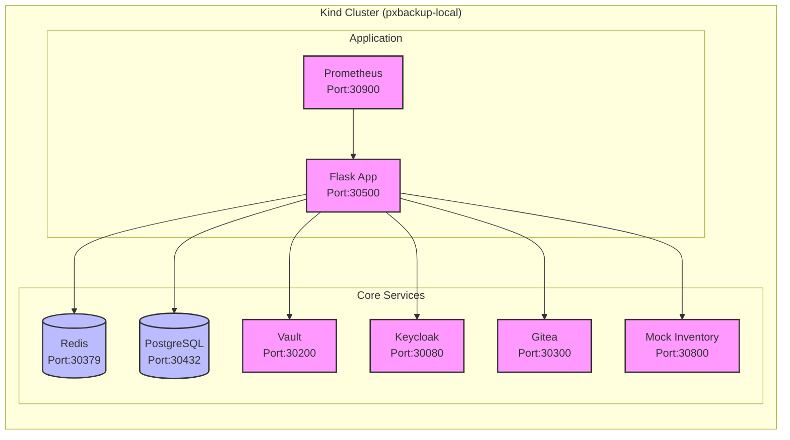

# Development Environment Setup

This document describes the development environment setup for the PX-Backup Ansible Runner application. The environment is containerized using Docker and Kubernetes (Kind) for local development.

## Prerequisites

### Required Software
- Docker (latest stable version)
- Kind (Kubernetes in Docker)
- kubectl (compatible with your Kind version)
- Python 3.9 or higher
- Base development tools (git, curl, etc.)

### System Requirements
- Minimum 4GB RAM available
- 20GB free disk space
- Linux-based operating system (tested on Fedora)

## Architecture

### Development Environment Components



### Service Descriptions

1. **Flask Application**
   - Main application service
   - Handles API requests and playbook execution
   - Development port: 30500
   - Supports hot-reloading and debugging

2. **Core Services**
   - **PostgreSQL**: Primary database (Port: 30432)
   - **Redis**: Caching and task queue (Port: 30379)
   - **Vault**: Secrets management (Port: 30200)
   - **Keycloak**: Authentication service (Port: 30080)
   - **Gitea**: Playbook repository (Port: 30300)
   - **Mock Inventory**: Test environment (Port: 30800)

3. **Monitoring**
   - **Prometheus**: Metrics collection (Port: 30900)
   - Supports horizontal pod autoscaling (HPA)

## Setup Process

### Local Development Setup Script (`setup_local.sh`)

The `setup_local.sh` script automates the following:

1. **Environment Validation**
   - Checks for required tools
   - Sets up Python virtual environment
   - Installs dependencies

2. **Cluster Setup**
   - Creates Kind cluster with custom configuration
   - Installs metrics-server
   - Sets up namespace and services

3. **Service Initialization**
   - Configures PostgreSQL database
   - Initializes Vault and stores secrets
   - Sets up Keycloak realm and client
   - Creates Gitea repositories
   - Populates mock inventory

4. **Application Deployment**
   - Builds and loads Docker images
   - Deploys application with Kustomize
   - Configures HPA

Usage:
```bash
./scripts/setup_local.sh
```

### Cleanup Script (`cleanup_local.sh`)

The `cleanup_local.sh` script performs cleanup in reverse order:

1. **Resource Cleanup**
   - Removes HPA configuration
   - Deletes all Kubernetes resources
   - Removes namespace and metrics-server

2. **Cluster Cleanup**
   - Deletes Kind cluster
   - Removes Docker images
   - Cleans up Python environment

3. **Data Handling**
   - Backs up Vault keys
   - Removes temporary files

Usage:
```bash
./scripts/cleanup_local.sh
```

## Development Workflow

1. **Initial Setup**
   ```bash
   # Clone repository
   git clone <repository-url>
   cd pxbackup-ansible-runner

   # Run setup script
   ./scripts/setup_local.sh
   ```

2. **Development**
   - The Flask application supports hot-reloading
   - Logs are available via `kubectl logs`
   - Debug port is exposed on 5678

3. **Testing**
   - Unit tests: `python -m pytest tests/unit`
   - Integration tests: `python -m pytest tests/integration`
   - API tests using mock inventory

4. **Cleanup**
   ```bash
   # Clean up environment
   ./scripts/cleanup_local.sh
   ```

## Troubleshooting

### Common Issues

1. **Port Conflicts**
   - Check if ports 30000-31000 are available
   - Modify port mappings in `kind/config.yaml` if needed

2. **Resource Constraints**
   - Ensure sufficient memory for all services
   - Check container resource limits in k8s/dev/*.yaml

3. **Service Dependencies**
   - Services are started in order of dependencies
   - Check service logs for connection issues

### Debug Commands

```bash
# Check pod status
kubectl get pods

# View application logs
kubectl logs -f deployment/flask-app

# Access services
curl http://localhost:30500/health

# Check Vault status
kubectl exec -it vault-0 -- vault status
```

## Security Notes

1. **Development Credentials**
   - Default credentials are for development only
   - Vault keys are backed up during cleanup
   - Never use development secrets in production

2. **Network Access**
   - Services are exposed via NodePort
   - Access is restricted to localhost
   - Use proper authentication in production

## Contributing

1. Create a feature branch
2. Make changes and test locally
3. Run cleanup script before switching branches
4. Submit pull request with updated documentation
